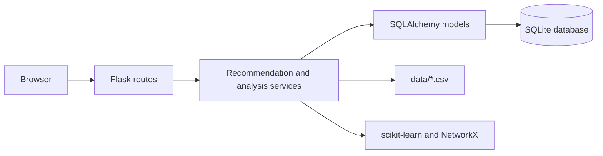

# AI-Powered Student Skill Intelligence

A Flask application that turns student skill evidence into explainable project
recommendations, next-skill suggestions, prerequisite-aware learning roadmaps,
skill evolution history, and what-if simulations.

## Features

- Student profiles with skills, self-reported proficiency, evidence, and PDF resume extraction.
- Content-based project recommendations using TF-IDF and cosine similarity.
- Skill recommendations based on gaps, prerequisite relationships, and project impact.
- Learning roadmaps sequenced with a NetworkX prerequisite graph.
- What-if simulation for testing the impact of a hypothetical skill boost without changing the database.
- Assessment history with trend and learning-velocity analysis.
- Per-student dashboard with proficiency chart, recommendations, and recent progress.
- Offline Precision@K and hit-rate evaluation helpers.

## Setup

The project targets Python 3.10+ on Windows, macOS, or Linux.

```powershell
cd student-skill-intelligence
python -m venv .venv
.venv\Scripts\Activate.ps1
python -m pip install -r requirements.txt
```

Initialize a new SQLite database and load the CSV data:

```powershell
python -m flask --app app:create_app init-db
python -m flask --app app:create_app load-sample-data
```

`init-db` creates missing tables but does not migrate an existing database.
When upgrading an older local database, back it up and recreate it (or apply
the schema changes with your chosen migration tool) before loading sample data.

Start the development server:

```powershell
python -m flask --app app:create_app run --debug
```

Open `http://127.0.0.1:5000/`. The default database is `student_skills.db` in
the project root. Set `DATABASE_URL`, `SECRET_KEY`, or `UPLOAD_FOLDER` to
override the defaults.

## Main Workflows

1. Open `/profile/` and create or select a student profile.
2. Add skills or upload a PDF resume and confirm extracted skills.
3. Open the student's dashboard for an overview of proficiency and recommendations.
4. Use project recommendations, skill recommendations, and the roadmap to plan work.
5. Record assessments in Skill Evolution to build a progress history.
6. Use What-If Simulator to compare recommendations after a hypothetical score change.

## Routes

| Route | Purpose |
| --- | --- |
| `/profile/` | List student profiles |
| `/profile/create` | Create a student profile |
| `/profile/<id>` | View and manage one profile |
| `/recommendations/student/<id>/dashboard` | Student dashboard |
| `/recommendations/student/<id>` | Project recommendations |
| `/recommendations/student/<id>/skills` | Skill recommendations |
| `/recommendations/student/<id>/roadmap` | Prerequisite-aware roadmap |
| `/recommendations/student/<id>/evolution` | Assessment history and recording |
| `/recommendations/student/<id>/whatif` | Hypothetical skill simulation |

## Architecture



The service layer contains the domain logic. Routes only load data, call a
service, and render a template. The main services are:

- `recommendation_engine.py`: project ranking and explanations.
- `skill_recommender.py`: gap and graph-based skill ranking.
- `roadmap_engine.py`: prerequisite expansion and stage sequencing.
- `simulator.py`: in-memory before/after recommendation comparison.
- `skill_evolution_tracker.py`: assessment history, trends, and velocity.
- `evaluation.py`: reusable offline recommendation metrics.

## Evaluation

Run the automated test suite:

```powershell
python -m pytest -q
```

Run the database-backed evaluation command:

```powershell
python -m flask --app app:create_app evaluate-recommendations
```

`evaluate_student` and `evaluate_students` accept explicit relevance labels:
`project_ids` and `skill_names`. This keeps Precision@K and hit rate tied to
instructor or benchmark labels rather than treating generated results as truth.

## Deployment Notes

For production, use a WSGI server such as Gunicorn or Waitress instead of
Flask's development server, set a strong random `SECRET_KEY`, configure a
persistent `DATABASE_URL`, and place the upload directory on durable storage.
The application currently permits PDF uploads up to 4 MB and stores uploaded
files under `UPLOAD_FOLDER`.

### Docker

Build and run the included Linux container:

```powershell
docker build -t student-skill-intelligence .
docker run --rm -p 8000:8000 `
	-e SECRET_KEY=replace-with-a-random-secret `
	-e DATABASE_URL=sqlite:////app/data/student_skills.db `
	student-skill-intelligence
```

For persistent SQLite data, mount a host directory at `/app/data` and mount
the upload storage at `/app/uploads`. After the container starts, initialize
the database and load the CSV data with:

```powershell
docker exec -it <container-name> python -m flask --app app:create_app init-db
docker exec -it <container-name> python -m flask --app app:create_app load-sample-data
```

## Testing

Tests use an in-memory SQLite database and cover profile flows, scoring, NLP
extraction, graph behavior, recommendations, simulation, evolution tracking,
dashboard rendering, and evaluation metrics.
